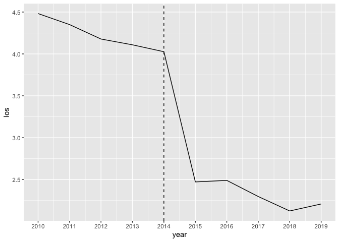
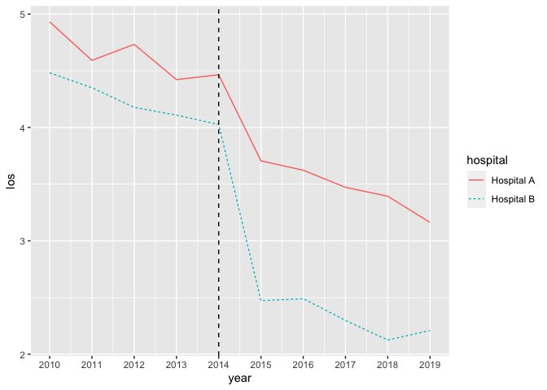

Enhanced recovery after surgery
================

## Background

Enhanced Recovery After Surgery (ERAS) is a set of protocols used in the
management of surgical patients before, during, and after an operation.
While the specific components of ERAS implemented depend on the type of
surgery, there are a few general principles:

Before surgery: pre-surgery counseling, meetings with the surgical team,
use of epidural for pain management. During surgery: shorter inclusions,
laparoscopic approaches when possible, conservative opioid pain
management. After surgery: encouraging movement soon after surgery,
quick transition to oral pain medications, resumption of normal
food/fluid intake. Prior studies have demonstrated that the use of ERAS
programs is associated with increased patient satisfaction, improved use
of hospital resources, decreased complications, and decreased morbidity
and mortality.

Imagine that a hospital system is interested in making the ERAS protocol
standard practice for all surgeries at all of its hospitals. One of the
hospitals in the system, Hospital B, has been using ERAS since the
beginning of 2015. Another hospital, Hospital A, does not use it.

The hospital’s administrators commission a study to determine whether
the use of ERAS at Hospital B led to a decrease in length of stay (LOS).
To assess the effectiveness of ERAS, the hospital administrators decide
to compare Hospital B to Hospital A. The average length of stay at
Hospital B and Hospital A was calculated for each of the years between
2010 and 2019.

In this project, we’ll use the Difference in Differences (DID) method to
evaluate whether implementation of the ERAS protocol led to a reduction
in the average hospital length of stay (LOS).

``` r
#import libraries
library(dplyr)
library(ggplot2)
```

``` r
#read-in data
df <- read.csv("los_data.csv")
```

``` r
#examine data
head(df)
```

    ##   year   hospital      los
    ## 1 2010 Hospital A 4.931446
    ## 2 2010 Hospital B 4.481862
    ## 3 2011 Hospital A 4.591706
    ## 4 2011 Hospital B 4.350371
    ## 5 2012 Hospital A 4.733123
    ## 6 2012 Hospital B 4.177808

``` r
#filter to hospital B and plot line chart
hosp_b <- df %>%
    filter(hospital == "Hospital B") %>%
    ggplot(aes(x = year, y = los)) +
    geom_line()+
    geom_vline(xintercept = 2014, linetype = "dashed")+
    scale_x_continuous(breaks = c(2010:2019))

print(hosp_b)
```

<!-- -->

``` r
#plot both hospitals
hosp_ab <- ggplot(data = df, aes(x = year, y = los, color = hospital, linetype = hospital)) +
    geom_line() +
    geom_vline(xintercept = 2014, linetype = "dashed") +
    scale_x_continuous(breaks = c(2010:2019))
    
print(hosp_ab)
```

<!-- -->

``` r
#create new dataset of only years 2014-2015
df_14_15 <- df %>%
    filter(year == 2014 | year == 2015)

print(df_14_15)
```

    ##   year   hospital      los
    ## 1 2014 Hospital A 4.464623
    ## 2 2014 Hospital B 4.026384
    ## 3 2015 Hospital A 3.705750
    ## 4 2015 Hospital B 2.472485

``` r
#work out difference in means for both hospitals
Adiff <- 3.705 - 4.4646
Bdiff <- 2.472 - 4.026
```

``` r
#work out the difference in means between the two hospitals
did <- Bdiff - Adiff

print(did)
```

    ## [1] -0.7944

The differencce in differences etweent he two hospitals is -0.7

## Get the same result using regression

``` r
#create indicator variables
df_14_15$treat <- ifelse(df_14_15$hospital == "Hospital B", 1, 0) #Hosp B is the treatment indicator variable
df_14_15$time <- ifelse(df_14_15$year == 2015, 1, 0) #Year 2015 is the time indicator variable
```

``` r
#fit model predicting los from treatment and time
hospital_model <- lm(los ~ treat*time, data = df_14_15)

print(hospital_model)
```

    ## 
    ## Call:
    ## lm(formula = los ~ treat * time, data = df_14_15)
    ## 
    ## Coefficients:
    ## (Intercept)        treat         time   treat:time  
    ##      4.4646      -0.4382      -0.7589      -0.7950

Interpreting the coefficients:

- intercept: Average los in control group (Hosp A) in 2014 was around
  4.46 days.
- treat: Average los in treatment group prior to implementation of
  treatment (Hosp B 2014) was around 0.44 days less than Hosp A.
- time: Average los in control group (Hosp A) after the time that
  treatment was implemented in treatment group (2015) was 0.76 days
  shorter.
- treat:time : the change in average los in Hosp B was an additional 0.8
  days fewer than the change los in Hosp A between 2014 and 2015.

``` r
#print ATT (Average Treatment effect of the Treated)
print(hospital_model$coefficients[4])
```

    ## treat:time 
    ## -0.7950255
